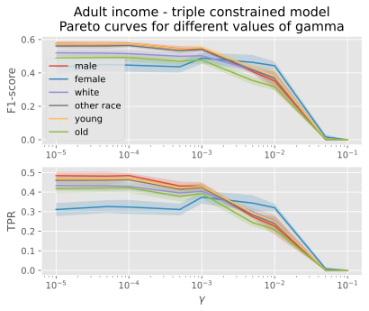

# Evaluating the robustness of group fairness penalty on biased datasets
### Project created by 
Mads Høgenhaug, Marcus Friis & Mia Pugholm

## Core content
The core content of this repo can be found in [notebook_income.ipynb](notebook_income.ipynb) and [notebook_dropout.ipynb](notebook_dropout.ipynb). Both of these notebooks contain our analysis of the group constraint applied to the *adult income* data and *student dropout* data. They're annotated and guide the reader through most of the thought process. They're a bit long, but there is a lot of content to cover as well. TL;DR, in them, we implement three models: a baseline logistic regression, a logistic regression group constrained on gender, and a logistic regression group constrained on gender, race/nationality, and age. We show the performance, the fairness, and how the decision process changes as we enforce constraints on groups.  

## Data
The data used for the project is the *adult income* data and *student dropout*. We downloaded both datasets from kaggle from the following sources:

* *adult income*: https://www.kaggle.com/datasets/wenruliu/adult-income-dataset \
* *student dropout*: https://www.kaggle.com/datasets/thedevastator/higher-education-predictors-of-student-retention
